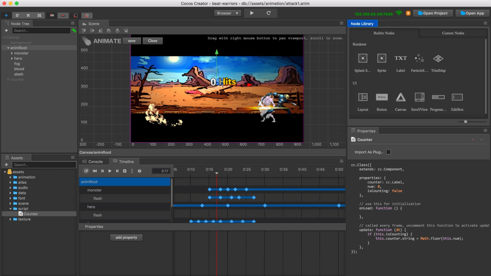

# COP 3003 Independent Project (Video Game)

This project is for COP 3033, which my current plan is to build a video game using different conecpts from C++. 

# Project Planning

Guides on choosing a project: https://sites.google.com/site/profvanselow/course/cop-3003/projects-3003

# Game Engine Example

Cocos is an open-source professional development toolkit for building games that provides a streamlined workflow for developers. With Cocos, you can quickly create projects, design games and animation clips, and package and publish games for distribution. Build Cocos games with the powerful Visual Studio IDE and debug with the world-class Visual Studio debugger to boost your productivity.

